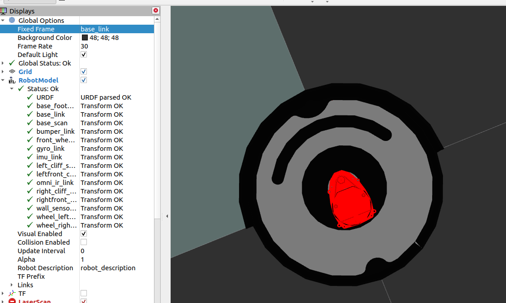
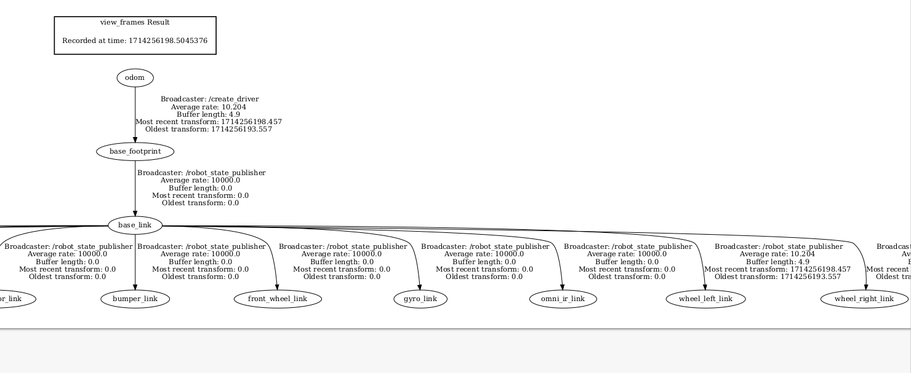
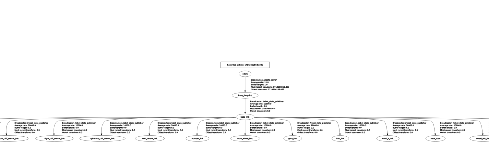

# Create 

## Usage Instructions

### System Requirements
- Ubuntu 20.04
- ROS 1 Noetic

### Installation Steps
1. **Install Turtlebot3 Packages:** Ensure that the Turtlebot3 packages are installed on your system.

2. **Clone Repository:**

Clone the repository to your ROS workspace (`src` folder).

3. **Update USB Serial Port Names:**
- Navigate to the following files:
  - `create_robot/create_bringup/config/default.yaml`
  - `rplidar_ros/launch/rplidar_a1.launch`
- Update the USB serial port names as needed. Typically, one is named USB1 and the other is named USB0.

4. **Build Workspace:**

Build your ROS workspace.

### Running the Navigation System

1. **Launch Navigation System:**
  `roslaunch create_navigation create_navigation.launch`

2. This launch command will automatically perform the following tasks:
- Initialize the lidar
- Start the Turtlebot3
- Launch the Map Server
- Run the AMCL (Adaptive Monte Carlo Localization) Node
- Activate the Move Base
- Launch Rviz for visualization


<!-- ## How to use

1. Using Ubuntu 20.04 and ROS 1 Noetic
2. Install turtlebot3 pakages
3. git clone this repo under src folder
4. Change USB serial port name in
  1. `create_robot/create_bringup/config/default.yaml`
  2. `rplidar_ros/launch/rplidar_a1.launch`
  3. Note that it is normally one is USB1 and the other is USB0
5. `catkin_make` under your ws folder
6. Run
  `roslaunch create_navigation create_navigation.launch`
7. This will automatically do such things:
  1. Run bringup for lidar
  2. Run bringup for create2
  3. Run Map Server
  4. Run AMCL Node
  5. Run Move base
  6. Run Rviz -->


## 4.27 Update

### TODO
- [ ] Configure Lidar successfully
- [ ] Fix map to base_link not found bug
- [ ] Using navigation to run it using gix map
- [ ] Make it able to navi in gix 2nd floor
- [ ] Add controller to control movement

### Using Turtlebot3 Navigation Package to Navigate iRobot Create2

This section details the modifications and setup required to use the Turtlebot3 navigation package for controlling the iRobot Create2 with an added RPLiDAR.

#### Codebase Setup
- **Location**: All modifications are made within the `create_robot/turtlebot3_navigation` directory.

#### URDF Modifications
- **Objective**: Adjust the URDF file to mimic the Turtlebot3 Burger setup and integrate RPLiDAR.
  - Rename `left_wheel` and `right_wheel` to match Turtlebot3 standard naming conventions for compatibility.
  - Add the RPLiDAR sensor to the URDF, ensuring proper mounting position and orientation.

#### Launch File: `create_navigation.launch`
- **Purpose**: Manage the startup sequence for robot navigation using ROS.
  - **Step 1**: Initiate the Create2 robot using the `create2_driver`.
  - **Step 2**: Launch the `map_server` to load the pre-existing map of the environment.
  - **Step 3**: Start the `amcl` node, which uses the `/scan` data from RPLiDAR to estimate the robot's position within the map.
  - **Step 4**: Launch the `move_base` node to handle path planning and obstacle avoidance.
  - **Step 5**: Execute `rviz` with a pre-configured setup to visualize and plan the robot's movements.

#### Configuration for `move_base`
- **Files**: Utilize parameter files stored in the `param` folder to configure the `move_base` node.
  - Parameters are tailored to match the dynamics and dimensions of the Create2 robot, adjusting settings such as maximum speed, acceleration, and obstacle safety distances.

#### Visualization 
  

  

  

  


- Topic List:


```
gixrobot11@gixrobot11-HP-ProBook-450-G6:~$ rostopic list
/amcl/parameter_descriptions
/amcl/parameter_updates
/amcl_pose
/battery/capacity
/battery/charge
/battery/charge_ratio
/battery/charging_state
/battery/current
/battery/temperature
/battery/voltage
/bumper
/check_led
/clean_button
/cmd_vel
/day_button
/debris_led
/define_song
/diagnostics
/dock
/dock_button
/dock_led
/hour_button
/initialpose
/ir_omni
/joint_states
/main_brush_motor
/map
/map_metadata
/map_updates
/minute_button
/mode
/move_base/DWAPlannerROS/global_plan
/move_base/DWAPlannerROS/local_plan
/move_base/NavfnROS/plan
/move_base/current_goal
/move_base/global_costmap/costmap
/move_base/global_costmap/costmap_updates
/move_base/goal
/move_base/local_costmap/costmap
/move_base/local_costmap/costmap_updates
/move_base/local_costmap/footprint
/move_base/recovery_status
/move_base_simple/goal
/odom
/particlecloud
/play_song
/power_led
/rosout
/rosout_agg
/scan
/set_ascii
/side_brush_motor
/spot_button
/spot_led
/tf
/tf_static
/undock
/vacuum_motor
/wheeldrop
```

 

## 4.24 Update

#### ROS Package Installation
- Installed `gmapping`, `navigation`, `robot_localization`, and `amcl` packages.

#### URDF Model Configuration
- Add a new package `my_robot_description`
- Configured and tested the URDF model including the LIDAR sensor.
- Visualized the model using RViz on a laptop through X11 forwarding.

#### Map Creation
- Created a map server
- Add the map using the `map_server` package.

#### Navigation Stack Setup
- Configured the `move_base` node with necessary parameters for path planning.
- Set up `AMCL` for localization with adjusted parameters for the robot.
- Configured `robot_localization` to fuse data from IMU, encoders, and LIDAR.
- Developed launch files to initiate map server, AMCL, `move_base`, and sensor drivers.
- All in this package:
```
my_robot_description/
│
├── config/                 # Directory for configuration files
│   ├── amcl_params.yaml
│   ├── costmap_common_params.yaml
│   ├── global_costmap_params.yaml
│   ├── local_costmap_params.yaml
│   ├── base_local_planner_params.yaml
│   └── ekf_params.yaml     # If using robot_localization
│
├── launch/                 # Directory for launch files
│   ├── navigation.launch
│   ├── amcl.launch.xml
│   └── move_base.launch.xml
│
├── maps/                   # Directory for storing map files
│   ├── your_map.yaml
│   └── your_map.pgm
│
├── urdf/                   # Directory for URDF files
│   ├── create2_with_lidar.urdf.xacro
│   └── create2_with_lidar.urdf
│
├── CMakeLists.txt          # Standard CMake list file for building ROS packages
└── package.xml             # Package information and dependencies

```


### Links from Zubin

How do we add LIDAR to a ROS robot? (youtube.com) https://www.youtube.com/watch?v=eJZXRncGaGM 

Easy SLAM with ROS using slam_toolbox (youtube.com) https://www.youtube.com/watch?v=ZaiA3hWaRzE 
 
These are also done in ROS 2 but the idea is the same. Seems like your group has successfully gotten the lidar to communicate with ROS, now you need to find which SLAM algorithm will work best for you guys

---

create3_examples/create3_lidar at galactic · iRobotEducation/create3_examples · GitHub https://github.com/iRobotEducation/create3_examples/tree/galactic/create3_lidar 
 
This is for create 3 but should still be applicable to create 2

## 4.18 Update

### Done
- [x] Setup Pi
- [x] Setup create2 with Pi
- [x] Setup Lidar with Pi
- [x] Done mapping, still working on details

### TODO
- [ ] Integration
  - Using turtlebot3 packages
    - Error
  - Using Rubin's link
    - It is ROS 2
    - https://hackaday.io/project/98624-autonomous-slam-with-a-roomba 
   
- [ ] Adding frames

- [ ] Write navigation calling code, input some str which presenting tags. Automatically navigate the robot.
  

## 4.16 Update
### 目前进度
- 设置扫地机器人
  - 型号是iRobot Create 2 (同时也是roomba6系列)
  - Link: https://edu.irobot.com/what-we-offer/create-robot 
- 安装依赖环境，实现基本控制
  - 在GIX Laptop上实现了对它的teleop，可以通过topic cmd_vel发送move指令
- 底层控制依赖于Create Robot Repo Driver包 [https://github.com/AutonomyLab/create_robot]
  - 此包依赖ROS2，所以需要在ROS2环境下运行
  - 由于系统是Ubuntu 2004,选择ROS2 Galactic版本
 
### TODO
- 使用树莓派
  - 在树莓派的SD卡上重新安装系统，最好是Ubuntu 2004: https://ubuntu.com/download/raspberry-pi, connect to wifi: https://ubuntuforums.org/showthread.php?t=249654
  - 在树莓派中安装ROS2（其他组使用ROS1，可能还需要设置ROS bridge）: https://docs.ros.org/en/galactic/Installation.html
- 安装雷达
  - 实现雷达与Laptop或者树莓派的正常连接:https://www.youtube.com/watch?v=WVyJjxAyGJc
  - 安装Driver，可以正常使用雷达功能
  - `roslaunch rplidar_ros view_rplidar_a1.launch`
  - 
- 集成树莓派+机器人+雷达
  - 实现基于给定地图的Navi

## Links

Create Robot Repo Driver
https://github.com/AutonomyLab/create_robot 

Create Robot Interface
https://cdn-shop.adafruit.com/datasheets/create_2_Open_Interface_Spec.pdf 

ROS2:
https://docs.ros.org/en/galactic/index.html

做完发现还有一个包是：https://github.com/MomsFriendlyRobotCompany/pycreate2 
不太清楚这个是否可以驱动，留作备用

## Setup Steps for Create 2

- Install ROS2

- Followe instruction in https://github.com/AutonomyLab/create_robot Install

- Build successfully(Remember to set ROS env correctly!)

- Run bringup: `ros2 launch create_bringup create_2.launch`

- Using teleop_test.py to control via cmd_vel topic

